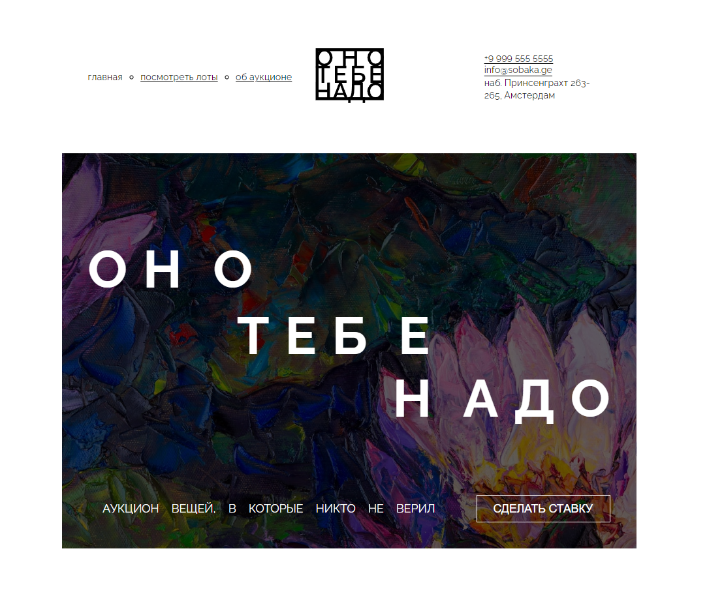
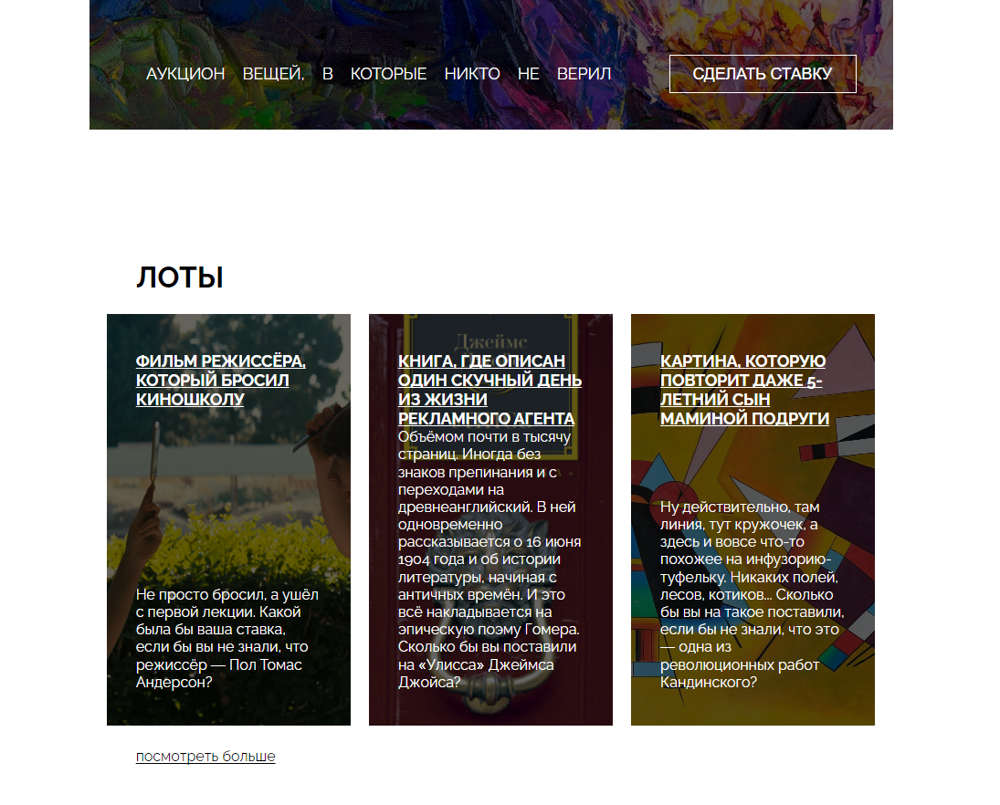
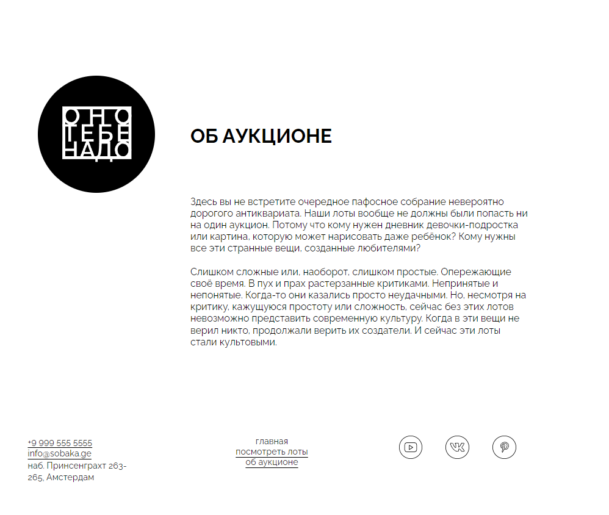

https://github.com/RiconCla/ono-tebe-nado.git
# Яндекс Практикум, проектная работа "Оно тебе надо"

## Оглавление

- [Запуск](#запуск)
- [Скриншоты](#скриншоты)
- [Описание](#описание)
- [Благодарность](#благодарность)

### Запуск

Достаточно перейти на [GitHub Pages](https://riconcla.github.io/ono-tebe-nado/)

### Скриншоты

### Описание

Небольшой лендинг вымышленного аукциона, выполненный только для декстопа. В данной работе упор был на семантике и сетке.

Использованные технологии: HTML, CSS, FLEX, GRID, BEM.

## Благодарность

Благодарю команду Яндекс Практикум за предоставление дизайна и уроков!
